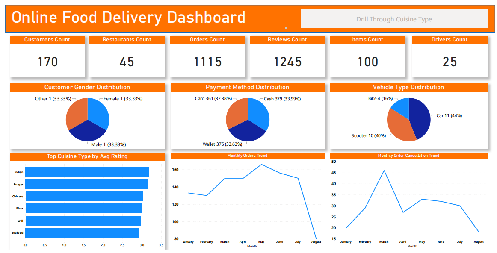
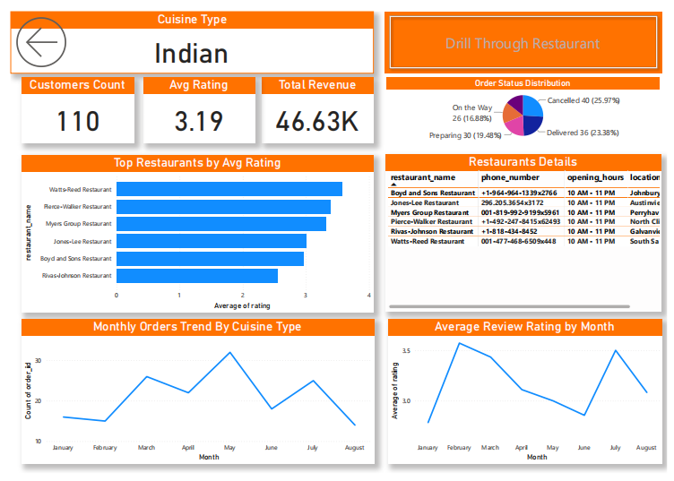
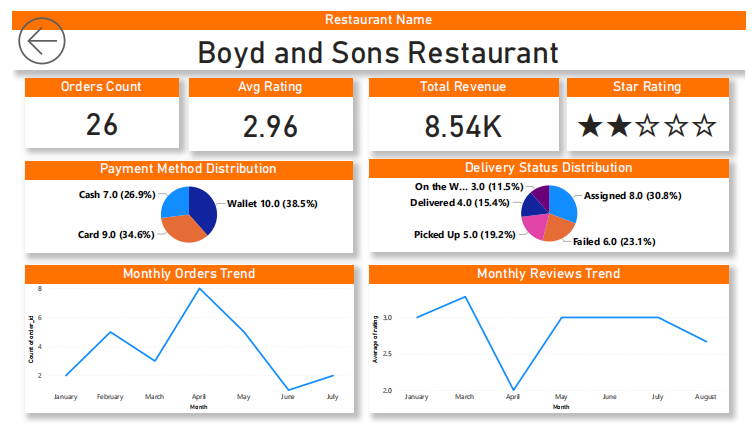

# 🍔 Online Food Delivery Dashboard w/ Power BI

## Introduction

This dashboard is designed for **restaurant owners, delivery managers,
and business analysts** who want to gain insights into the online food
delivery market. It consolidates scattered information about customers,
restaurants, orders, and reviews into a single interactive view. Using
real-world delivery data, the dashboard highlights customer behavior,
order trends, payment preferences, and restaurant performance ---
enabling data-driven decisions to optimize operations and improve
customer satisfaction.

------------------------------------------------------------------------

## Skills Showcased

This project demonstrates a full range of **data engineering, analytics,
and visualization** skills, including:

🔧 **Power BI Development**\
- Interactive dashboards with slicers, drill-throughs, and filters\
- Consistent layouts and clear navigation between pages\
- Publishing and sharing via Power BI Service

🧮 **Data Modeling & DAX**\
- KPIs: *Total Revenue, Avg Rating, Monthly Orders*\
- Time intelligence functions (monthly orders, cancellations, reviews)\
- Relationships between customers, restaurants, orders, and reviews

🧹 **Data Cleaning & Transformation**\
- Power Query for handling missing values and formatting\
- Standardization of cuisine, payment methods, and delivery statuses\
- Normalization of customer and restaurant attributes

📊 **Data Visualization**\
- KPI cards (Orders, Revenue, Avg Rating, Customers, Restaurants,
Drivers)\
- Charts: bar, line, pie, maps for orders, revenue, payments, and
vehicles\
- Drill-through analysis for cuisines and restaurants

🔎 **Business & Market Analysis**\
- Customer preferences by cuisine type and payment method\
- Restaurant performance (revenue & ratings)\
- Delivery performance by vehicle type and status\
- Seasonal order and review patterns

------------------------------------------------------------------------

## Database Design & Data Pipeline

This project goes beyond dashboards, including **end-to-end data
handling**:

-   **Database (SQL Server)**
    -   Normalized schema for **Customers, Restaurants, MenuItems,
        Orders, OrderDetails, Reviews, and DeliveryDrivers**\
    -   Relationships:
        -   Customers → Orders (1:∞)\
        -   Restaurants → Orders, MenuItems (1:∞)\
        -   Orders → Reviews, OrderDetails, DeliveryAssignments (1:1 or
            1:∞)\
        -   Drivers → DeliveryAssignments (1:∞)
-   **Synthetic Data Generation (Python + Faker)**
    -   Populated tables with realistic fake data (names, phones,
        cuisine types, menu prices, orders, ratings).
-   **Exploratory Data Analysis (pandas)**
    -   Univariate (payment distributions, cuisine preferences)\
    -   Bivariate (payment vs cancellation, cuisine vs rating)\
    -   Multivariate (time × cuisine × ratings, price × payment ×
        status)
-   **Visualization Layer**
    -   **Power BI:** Interactive dashboard with KPIs, monthly trends,
        and drill-throughs\
    -   **Excel:** Pivot tables, charts, and slicers for ad hoc analysis

------------------------------------------------------------------------

## Dashboard Overview

### 📊 Page 1: Market Overview

**High-level summary** of the food delivery market:\
- Totals: 1,115 orders, 170 customers, 45 restaurants, 25 drivers, 1,245
reviews, 100 menu items\
- Total Revenue ≈ 46.63K; Avg Rating = 3.19\
- Monthly order & cancellation trends\
- Payment & vehicle type distributions\
- Cuisine popularity & top performers

------------------------------------------------------------------------

## 📈 Insights You Can Gain

-   Which cuisines are most popular and highly rated?\
-   Which restaurants drive the most revenue?\
-   What delivery vehicle types optimize speed and cost?\
-   How do payments split across cash, wallet, and cards?\
-   Where are operational issues (cancellations, failed deliveries) most
    common?

------------------------------------------------------------------------

## Conclusion

This project demonstrates the **full lifecycle of data analytics**:\
1. **SQL schema design** for structured data\
2. **Synthetic data generation** with Python\
3. **Cleaning & EDA** with pandas\
4. **Visualization** in Power BI & Excel

The platform is growing in orders and revenue, but high cancellations
(\~26%) and average ratings (3.19) highlight opportunities for
improvement. Focusing on **delivery reliability, restaurant coaching,
digital payments, and scooters for urban areas** can improve
satisfaction and long-term scalability.
